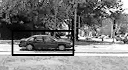
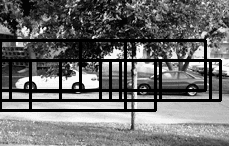

# object-detector
Object Detector using HOG as descriptor and Linear SVM as classifier.

## Run the code

I have created a single python script that can be used to test the code. To test the code, run the lines below in your terminal.

```shell
git clone https://github.com/leeyamkeng/object-detector.git
cd object-detector/bin
test-object-detector
```

_The `test-object-detector` will download the [UIUC Image Database for Car Detection](https://cogcomp.cs.illinois.edu/Data/Car/) and train a classifier to detect cars in an image. The SVM model files will be stored in `data/models`, so that they can be resused later on._

### Configuration File

All the configurations are in the `data/config/config.cfg` configuration files. You can change it as per your need. Here is what the default configuration file looks like (which I have set for Car Detector)-

```bash
[hog]
min_wdw_sz: [100, 40]
step_size: [10, 10]
orientations: 9
pixels_per_cell: [8, 8]
cells_per_block: [3, 3]
visualize: False
normalize: True

[nms]
threshold: .3

[paths]
pos_feat_ph: ../data/features/pos
neg_feat_ph: ../data/features/neg
model_path: ../data/models/svm.model
```

### About the modules

* `extract-features.py` -- This module is used to extract HOG features of the training images.
* `train-classifier.py` -- This module is used to train the classifier.
* `nms.py` -- This module performs Non Maxima Suppression.
* `test-classifier.py` -- This module is used to test the classifier using a test image.
* `config.py` -- Imports the configuration variables from `config.cfg`.

## Some of the results

#### Test Image 1
_Detections before NMS_


_Detections after NMS_


#### Test Image 2
_Detections before NMS_


_Detections after NMS_


#### Test Image 3
_Detections before NMS_


_Detections after NMS_


#### Test Image 4
_Detections before NMS_



_Detections after NMS_


## TODO

Here is list of tasks that I am planning to implement in the future -

* Optimize code to use more `numpy` vectorized codes.
* Faster NMS code.
* Add bootstrapping (Hard Negative Mining) code.